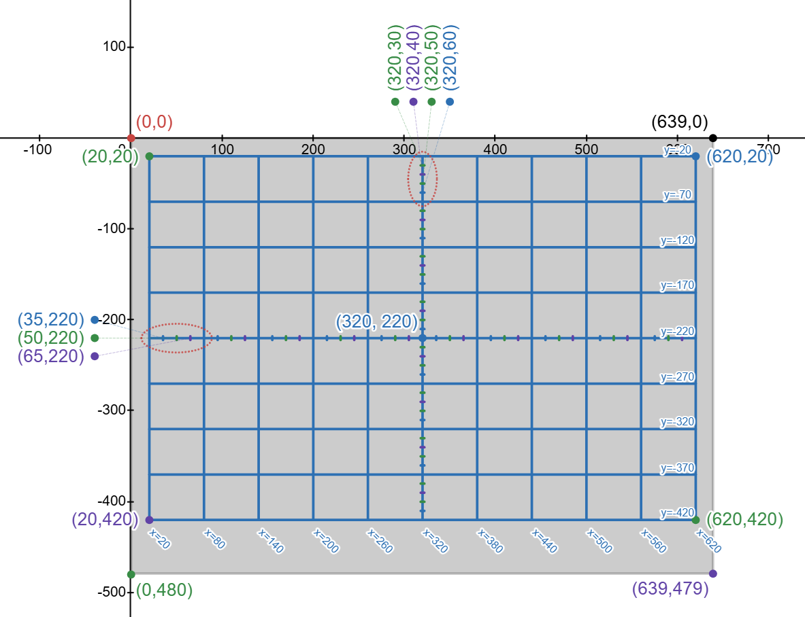
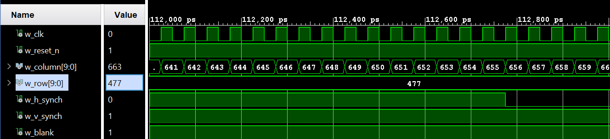
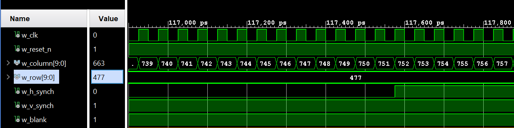
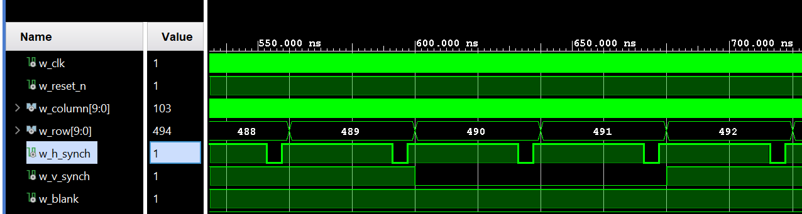

## Introduction
Provide a brief overview of the problem.

*The purpose of this lab is to implement VGA protocol on the Nexys Video Board FPGA, allowing display of an oscilloscope grid, waveforms, and trigger arrows. The intention with this lab is that later labs will be able to utilize the waveform visualizations to display analog signals.*

## Design/Implementation
Include your diagrams from HW5. Provide the block-diagram of your solution using the signal names in your code. The block diagram given above is somewhat incomplete, make sure to include corrections to this diagram. An editable block diagram PPT is provided here. For each module that you built, explain its overall purpose, inputs, outputs, and behavior. You do not need to include code in this report (instead put all your vhdl files (code and testbench), wcfg file, and bit files in GitHub).




## Test/Debug
Briefly describe the methods used to verify system functionality (such as products from gate check 1 and 2).

### VGA Test Bench:


### Show the `h_synch` going high, low, and high in relation to column count.
The intended behavior of the horizontal timing is depicted below:
```{image} ./images/Lab01_HorizontalTiming.jpg
:width: 760
:align: center
```
There should be 640 pixels of active video followed by 16 pixels of the front porch before the `h_synch` signal goes low. This means you should see thhe pixel go low between the 656 and 657th column. Since the 1st column is 0, this shift occurs when `w_column` goes from 655 to 656. This is demonstrated below, around the 112,775ps point on the time axis.

There should then be 96 pixels of the `h_synch` period. Using similar logic/math, the `h_synch` should end between the `w_column` values 751 and 752. This can be seen around 117,575ps in the wavform below.



### Show the `v_synch` going high, low, and high in relation to row count AND column count.
The intended behavior of the vertical timing is depicted below:

There should be 480 lines followed by 10 lines of the front porch before the `v_synch` signal goes low, meaning our `w_row` count should be 489 turning to 490 when it goes low. It should remanain like this for 2 rows, going back to high between `w_row` value 491 and 492. This is easily seen below.



### Show the blank signals going high, low, and high in relation to column count and row count.
Based on the 

### Show the column count rolling over causing the row count to increment and max counts for both counters.

### Major Problems

During this process, I ran into several problems which made implementation much more difficult. Although the most of the big problems weren

Major Problem 1: Windows marking files as "read only"

Major Problem 2: Github file management (operator error)

Major Problem 3: Buttons cause trigger levels to scroll at maximum speed with no delay.

## Results
This section should clearly state for each milestone/functionality the date/time it was achieved, level of achievement (e.g, achieved, partially-achieved, not achieved), what was achieved, and evidence you proved it worked (e.g., via demo or images/videos). We no longer use the printed lab cutsheets signed by your instructor as you meet each milestone, but instead have you make a submission in Gradescope for each milestone.

| Milestone    | Date/Time           | What was acheived:                               |
| :----------- | :------------------ | :----------------------------------------------- |
| Gate Check 1 | 2025-01-24 21:37    | Implemented and demonstrated via screenshots uploaded to GitHub the functionality of the row and column counters, as well as appropriate rollover. |
| Gate Check 2 | 2025-01-27 23:51    | Implemented and demonstrated via screenshots uploaded to Github the functionality of the synch and blank signals as the row and column counters progress. |
| Lab 1 Full Functionality | 2025-02-04 08:30 | Completed scopeface module and channel logic, demonstrating an output on monitor showing the two waveforms, gridlines, trigger arrows, and hash marks. |

## Conclusion - Explain what your learned from this lab and what changes you would recommend in future years to this lab or the lectures leading up to this lab.