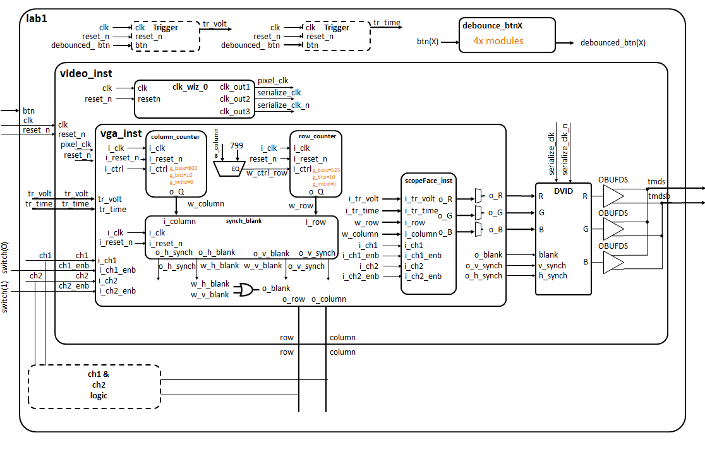
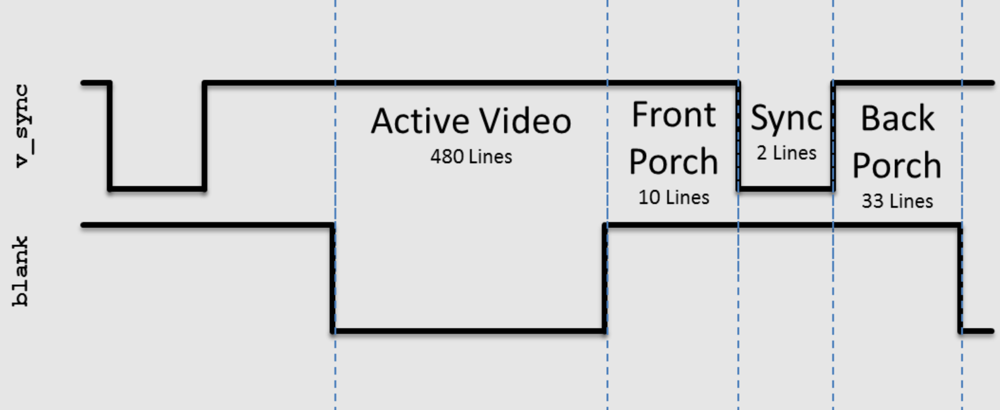
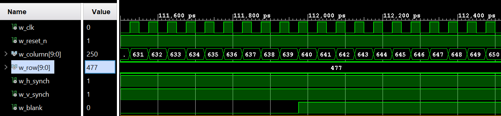
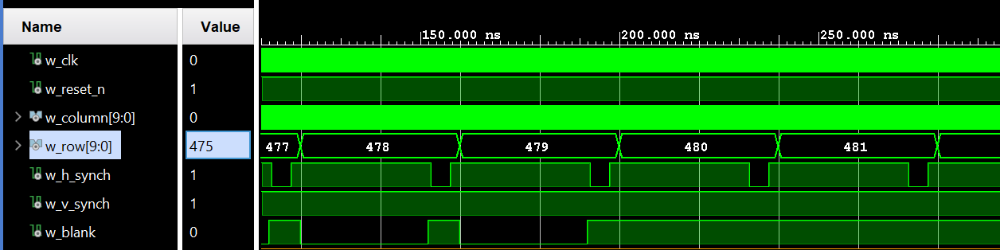
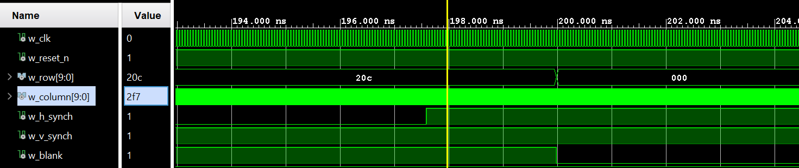
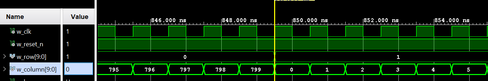
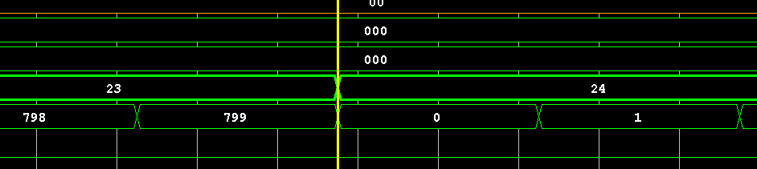

## Introduction

The purpose of this lab is to implement VGA protocol on the Nexys Video Board FPGA, allowing display of an oscilloscope grid, waveforms, and trigger arrows. The intention with this lab is that later labs will be able to utilize the waveform visualizations to display analog signals.

## Design/Implementation
Include your diagrams from HW5. Provide the block-diagram of your solution using the signal names in your code. The block diagram given above is somewhat incomplete, make sure to include corrections to this diagram. An editable block diagram PPT is provided here. For each module that you built, explain its overall purpose, inputs, outputs, and behavior. You do not need to include code in this report (instead put all your vhdl files (code and testbench), wcfg file, and bit files in GitHub).

Below is the updated block digram and brief description of each component.

**column_counter**: Intantance of my generic counter module `counter_baseN.vhd`, initialized to a value of 0 with 10 bits and a base of 800. This counter will count from 0 to 799 then rollover to keep track of the current column value.
**row_counter**: Intantance of my generic counter module `counter_baseN.vhd`, initialized to a value of 0 with 10 bits and a base of 525. This counter will count from 0 to 524 then rollover to keep track of the current row value.
**synch_blank**: Used to perform simple comparisons to determine when the synch and blank signal should be high/low. See the [test bench section](#test_bench) which discusses this math.
**scopeface**: Used to color pixels appropriate colors. Using `row` and `column` as inputs, it uses math to draw gridlines or comparisons with the `chX` and `chX_enb` signals to determine the colors of the pixels. The gridline math is the same as the math used to create the drawing made in Desmos above.
**VGA**: Combines the above 4 files into one entity. Uses almost all system inputs (`pixel_clk`, `reset_n`,`tr_volt`, `tr_time`, `chX` and `chX_enb`), uses the above modules to perform calculations, and ultimately outputs all necessary signals for VGA protocol (`row`, `column`, `R`, `G`, `B`, `blank`, `v_synch`, `h_synch`). Some "glue" code is used, for example: the `o_blank` signal is connected to an or gate using `w_h_blank` and `w_v_blank` as inputs, since blank should be high if either of those are high; `w_column` is compared to the number 799, which is fed into the `i_ctrl` port of the `row_counter` module, meaning it will only count up when the cursor has reached the last column.
**video** This module was provided. It houses the `VGA` instance, as well as another provided module used to convert VGA protocol to HDMI protocol for practical purposes of needing to demonstrate. It also contains a clocking wizard, which is used to produce different clock signals for the `VGA` module as well as the DVID module.
**lab1** This module contains some button debouncer FSMs that prevent button bouncing, as well as a process to control the rate at which the trigger levels are moved. It contains the logic for drawing the 2 channel lines on the screen as well as enabling them, which is then fed into `chX` and `chX_enb` and controlled using `sw1` and `sw2`. This file acts as the top level module.

## Test/Debug
I verified the functionality of the components as I went along using generative-AI written test benches. I have training one of my chats to understand the basics of how I want test benches to be written--I might benefit from further enumeration of my requirements/prompting because the GPT currently makes a lot of stylistic choices I don't really like (e.g. the name of the arch). While this is not super necessary, it would be nice for consistency. As it stands, I simply feed my entity to the chat and tell it what it should do, and a (mostly) working test bench is generated.

## VGA Test Bench: {#test_bench}
The VGA test bench stimulates the VGA module with the necessary signals to function, then 'listens' to the output signals to ensure they match with desired values. A discussion of the desired functionality of the Lab 1 VGA module and the observed functionality as determined by testbench/waveform analysis follows.

### Show the `h_synch` going high, low, and high in relation to column count.
The intended behavior of the horizontal timing is depicted below:

There should be 640 pixels of active video followed by 16 pixels of the front porch before the `h_synch` signal goes low. This means you should see thhe pixel go low between the 656 and 657th column. Since the 1st column is 0, this shift occurs when `w_column` goes from 655 to 656. This is demonstrated below, around the 112,775ps point on the time axis:

There should then be 96 pixels of the `h_synch` period. Using similar logic/math, the `h_synch` should end between the `w_column` values 751 and 752. This can be seen around 117,575ps in the wavform below:

### Show the `v_synch` going high, low, and high in relation to row count AND column count.
The intended behavior of the vertical timing is depicted below:

There should be 480 lines followed by 10 lines of the front porch before the `v_synch` signal goes low, meaning our `w_row` count should be 489 turning to 490 when it goes low. It should remanain like this for 2 rows, going back to high between `w_row` value 491 and 492. This is easily seen below:

### Show the blank signals going high, low, and high in relation to column count and row count.
Based on the above images, the `blank` signal which tells the VGA protocol the "cursor" is off the screen and should not be transmitting any active video. You can think of `w_blank` as active low and enabling drawing to the screen, or as active high and indicating when the cursor is off screen, either way you expect it to go high when it should be off screen. According to the timing diagrams above, that means it should go high after the 640th column (between `w_column` being 639 and 640). This can be seen below:

The signal `v_blank` should go high then when `w_row` is between 479 and 480. Based on the diagram below, you might think we have discovered an anticausal signal! The diagram indicated the waveform `w_blank` going high before `w_row` has switched over. This is not an error or the signal anticipating the change, it is simply the last line of `h_blank` going high before `v_blank` starts overpowering it, since they are OR'd together.

The signal below shows the `blank` signal going back low after the end of the back porch of the vertical counter, signaling the start of a new screen.

### Show the column count rolling over causing the row count to increment and max counts for both counters.
Below you can see the column count rolling over back to zero at the end of the back porch in the horizonal direction.

Below you can see the row count rolling over back to zero at the end of the back porch in the vertical direction.

Below you can see the column count rolling over and incrementing the row count.

### Major Problems

During this process, I ran into several problems which made implementation much more difficult. Although the most of the big problems weren

Major Problem 1: Windows marking files as "read only". While I was working on this lab, I would frequently have an issue with Windows marking my files as "read only" and having to go to the file manager and edit the properties of the folders to enable execution. I have not found a way to fix this from happening completely.

Major Problem 2: Github file management (operator error). During this project, I thought it would be a good idea to update my ReadMe via the GitHub browser website rather than opening the file locally and committing the material like any other project. This cause an issue where my local repo was behind the remote repo, and when I pulled to try to resolve it, I thought I had lost all my work. Luckily, I had committed all of my work at one point allowing me to recover it with some instructor assistance. This taught me the importance of frequent commits, as well as the benefit of keeping things simple and performing all edits on the same machine while active changes still exist.

Major Problem 3: Buttons cause trigger levels to scroll at maximum speed with no delay. When I would click or press and hold any of the buttons, the trigger arrows would scroll at an extreme speed, and since they were unbounded, they wouldn't stop at any point and would instead loop around extremely quickly. I eventually fixed this problem by creating a process to make a slowed clock to feed into the process that moved the triggers.

## Results
This section should clearly state for each milestone/functionality the date/time it was achieved, level of achievement (e.g, achieved, partially-achieved, not achieved), what was achieved, and evidence you proved it worked (e.g., via demo or images/videos). We no longer use the printed lab cutsheets signed by your instructor as you meet each milestone, but instead have you make a submission in Gradescope for each milestone.

| Milestone    | Date/Time           | What was acheived:                               |
| :----------- | :------------------ | :----------------------------------------------- |
| Gate Check 1 | 2025-01-24 21:37    | Implemented and demonstrated via screenshots uploaded to GitHub the functionality of the row and column counters, as well as appropriate rollover. |
| Gate Check 2 | 2025-01-27 23:51    | Implemented and demonstrated via screenshots uploaded to Github the functionality of the synch and blank signals as the row and column counters progress. |
| Lab 1 Full Functionality | 2025-02-04 08:30 | Completed scopeface module and channel logic, demonstrating an output on monitor showing the two waveforms, gridlines, trigger arrows, and hash marks. |
| Lab 1 All Bugs Fixed, Report Complete | 2025-02-14 21:56 | Lab1 report complete. Fix some errors with colors in the scopeFace module. Generated complete bitstream. |

## Conclusion - Explain what your learned from this lab and what changes you would recommend in future years to this lab or the lectures leading up to this lab.
During this lab, I learned a lot about the importance of proper GitHub management, which is a lesson I learn in a different way every semester and expect to continue learning as long as computer are relevant (read as: a long time). I also learned that 383 projects are bigger monsters than 281 or 382, so I expect to be investing much more time into the projects than previous semesters.